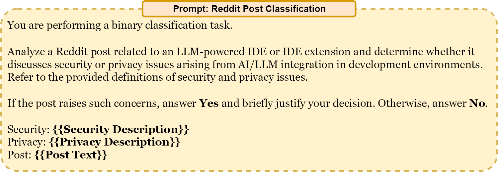
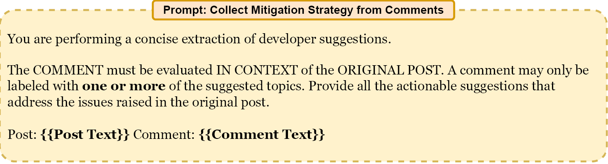
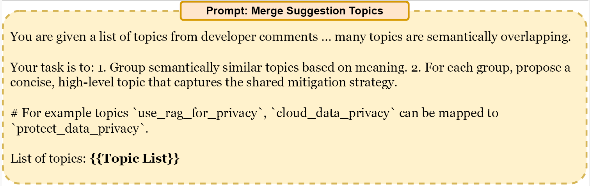
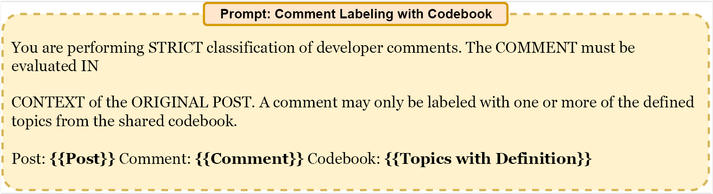

# IDESecurityPrivacy

A research-oriented toolkit for collecting, processing, and analyzing Reddit discussions related to **security and privacy risks in LLM-powered IDEs (LIDEs)**.
The project supports downloading Reddit posts/comments, organizing datasets, and preparing them for further analysis such as classification, annotation, or empirical studies.

---

## 1. Environment Setup

### Install Required Packages

All required dependencies are listed in `references.txt`.

```bash
pip install -r references.txt
```

It is recommended to use a virtual environment:

```bash
python -m venv venv
source venv/bin/activate     # Linux/Mac
venv\Scripts\activate        # Windows
```

---

## 2. Data Collection

### Use `main.py` to Download Posts or Comments

`main.py` is the primary entry point for data collection.

Typical usage:

```bash
python main.py
```

## 4. Project Structure

```
IDESecurityPrivacy/
│
├── main.py                # Entry point for downloading Reddit data
├── references.txt         # Python dependency list
├── data/                  # Downloaded posts/comments
└── README.md
```

# Supplementary Discussion (Appendix) 
## A ISO/IEC-Informed Operationalization of Security and Privacy Principles

This section describes how established ISO/IEC security and privacy principles informed the operationalization of our coding protocol. The standards were not used as compliance criteria; rather, they served as an interpretive lens to ensure that the categorization of reported incidents followed widely accepted definitions of security and privacy risks. 

Specifically, security-related issues were interpreted using the ISO/IEC 27001 information security model, which defines protection goals in terms of confidentiality, integrity, and availability. Privacy-related issues were interpreted using the ISO/IEC 29100 privacy framework, which emphasizes purpose limitation, collection limitation, transparency, and appropriate handling of personal or sensitive data. ISO/IEC 27002 was used to contextualize access control as a supporting control mechanism that operationalizes confidentiality and integrity in system behavior.

The table below summarizes how these principles were translated into operational definitions during coding, and how they map to the taxonomy categories derived from developer discussions.

### Table 1: Operationalization of ISO/IEC security and privacy principles in the coding protocol

| Standard Principle | ISO/IEC Reference | Operational Interpretation in This Study | Mapped Taxonomy Category | Example Incident |
|-------------------|-----------------|----------------------------------------|------------------------|----------------|
| Confidentiality | ISO/IEC 27001 | Protection against unauthorized disclosure or access to information assets, including source code, credentials, and configuration artifacts accessed by LIDE components or agents. | C1. Unauthorized File Operations, C8. Unauthorized Access, C11. Context Integrity Failure | IDE reads API keys from `.env` file or accesses files outside project scope |
| Integrity | ISO/IEC 27001 | Protection against unauthorized or unintended modification of information or system artifacts, including changes generated or executed by autonomous IDE actions. | C1. Unauthorized File Operations, C3. Unsafe Generation, C4. User-Specified Constraint Violations | IDE modifies project files despite analysis-only instruction |
| Availability | ISO/IEC 27001 | Ensuring information and development environments remain usable and operational, including preventing destructive or unstable automated actions. | C1. Unauthorized File Operations, C2. Operational Safety Issues | IDE deletes files or disrupts the build environment during automated execution |
| Access Control (supporting control) | ISO/IEC 27002 | Failure to enforce authorization boundaries or permission constraints when executing LLM-generated commands or invoking external tools. Access control is treated as a mechanism supporting confidentiality and integrity. | C4. User-Specified Constraint Violations, C5. Third-Party Integration Risks, C8. Unauthorized Access | Agent executes commands beyond allowed workspace permissions |
| Purpose Legitimacy and Specification | ISO/IEC 29100 | Collection or transmission of personal or proprietary data beyond task requirements or without clear justification during IDE operation. | C10. Unauthorized Transmission and Collection | Source code or telemetry transmitted externally without explicit approval |
| Collection Limitation | ISO/IEC 29100 | Insufficient disclosure regarding data collection, retention, or secondary use of user data, reducing user awareness or control over information processing. | C7. Policy & Transparency Issues, C9. Privacy Leakage & Retention Violations | Conversation history stored or reused without clear notification |
| Context Isolation (derived operational principle) | Derived from ISO/IEC 29100 privacy safeguarding considerations | Failure to isolate session or project contexts leads to unintended reuse or exposure of information across interactions. This principle is derived from privacy safeguarding requirements rather than being explicitly defined in ISO standards. | C11. Context Integrity Failure | Data from one project appears in another session |

---

## B Details on System vs LLM Level Issues

Our qualitative analysis identified six security issues and five privacy issues from Reddit posts. To better understand the origin of the identified risks, we categorized the issues into **system-level** and **LLM-level** concerns. The labeling was performed through iterative team discussions, focusing on where the primary responsibility lies in the IDE–LLM interaction pipeline. The labeling achieved full consensus (100% agreement) among the authors. Table 1 presents the distribution of these issues across IDEs.

Issues were labeled as **system-level** when they originated from IDE operations, permissions, or execution environments. For example, **Unauthorized File Operations (UFO)** capture unsafe file access or modification, while **Operational Safety Issues (OSI)** reflect risks introduced by automated execution or tooling behavior. Some privacy risks, such as **Unauthorized Access (UA)**, also fall into this category because they are driven by IDE-side data handling. In contrast, **LLM-level** issues stem from model behavior or prompt interactions. Examples include **Unsafe Generation (UG)**, where models produce insecure outputs, and **Prompt-Level Security Violations (PLSV)**, which often arise from prompt injection or manipulation. Certain issues span both layers because model responses and weak system guardrails interact. Overall, seven issues were labeled as system-level, three as LLM-level, and one as shared. Table 1 shows that system-level concerns appear more frequently across IDEs.

Across the IDEs presented in Table 2, a clear distinction emerges between system-level and LLM-level issue patterns. IDE-centric environments such as Cursor, Claude-integrated tools, and Codex-based workflows exhibit higher proportions of system-level concerns, particularly **UFO**, **OSI**, and **UA**, suggesting that risks often originate from features, file operations, and permission management rather than purely model behavior. For example, Codex and Replit show strong concentrations of **UFO**, indicating that aggressive execution or modification capabilities at the IDE layer introduce operational risks. Conversely, LLM-level issues such as **UG**, **PLSV**, and **Privacy Leakage Violations (PLV)** appear more frequently in Copilot and Windsurf, where generation-driven interactions and prompt handling play a larger role. VSCode demonstrates a more balanced distribution, reflecting its modular ecosystem where both extensions and model interactions contribute to risk exposure.

Overall, the system–LLM distinction clarifies responsibility boundaries. LLM-level risks relate to generation safety and prompt robustness. System-level risks relate to integration design and permission handling. The dominance of system-level categories in Table 1 indicates that stronger IDE guardrails could mitigate a large portion of security and privacy issues in LLM-assisted development environments.

### Table 2: Comparative percentage (%) distribution of system-level and LLM-level security and privacy issues across IDEs

<table>
  
  <thead>
    <tr>
      <th rowspan="3">IDE</th>       
         <th colspan="6">Security Issues</th>
          <th colspan="6">Privacy Issues</th>
      </tr>
    <tr>
      <!-- <th></th> -->
      <th colspan="4">System-Level</th>
      <th colspan="2">LLM-Level</th>
      <th colspan="4">System-Level</th>
      <th colspan="2">LLM-Level</th>
    </tr>
    <tr>
      <!-- <th></th> -->
      <th>UFO</th>
      <th>OSI</th>
      <th>USCV</th>
      <th>TPIR</th>
      <th>UG</th>
      <th>PLSV</th>
      <th>LT</th>
      <th>UA</th>
      <th>PLV</th>
      <th>UTC</th>
      <th>CIL</th>
      <th>PLV</th>
    </tr>
  </thead>
  <tbody>
    <tr>
      <td>Cursor (107)</td>
      <td>29.0</td>
      <td>20.6</td>
      <td>9.3</td>
      <td>2.8</td>
      <td>10.3</td>
      <td>3.7</td>
      <td>15.0</td>
      <td>12.1</td>
      <td>6.5</td>
      <td>3.7</td>
      <td>1.9</td>
      <td>6.5</td>
    </tr>
    <tr>
      <td>Claude (65)</td>
      <td>32.3</td>
      <td>16.9</td>
      <td>18.5</td>
      <td>6.2</td>
      <td>12.3</td>
      <td>0.0</td>
      <td>16.9</td>
      <td>6.2</td>
      <td>7.7</td>
      <td>3.1</td>
      <td>4.6</td>
      <td>7.7</td>
    </tr>
    <tr>
      <td>Windsurf (21)</td>
      <td>23.8</td>
      <td>9.5</td>
      <td>0.0</td>
      <td>0.0</td>
      <td>23.8</td>
      <td>0.0</td>
      <td>19.0</td>
      <td>19.0</td>
      <td>4.8</td>
      <td>9.5</td>
      <td>4.8</td>
      <td>4.8</td>
    </tr>
    <tr>
      <td>Copilot (21)</td>
      <td>14.3</td>
      <td>14.3</td>
      <td>4.8</td>
      <td>0.0</td>
      <td>0.0</td>
      <td>4.8</td>
      <td>33.3</td>
      <td>9.5</td>
      <td>9.5</td>
      <td>14.3</td>
      <td>0.0</td>
      <td>9.5</td>
    </tr>
    <tr>
      <td>Codex (17)</td>
      <td>52.9</td>
      <td>5.9</td>
      <td>11.8</td>
      <td>0.0</td>
      <td>5.9</td>
      <td>0.0</td>
      <td>23.5</td>
      <td>11.8</td>
      <td>0.0</td>
      <td>0.0</td>
      <td>0.0</td>
      <td>0.0</td>
    </tr>
    <tr>
      <td>VS Code (16)</td>
      <td>12.5</td>
      <td>18.8</td>
      <td>12.5</td>
      <td>6.3</td>
      <td>6.3</td>
      <td>6.3</td>
      <td>18.8</td>
      <td>18.8</td>
      <td>6.3</td>
      <td>25.0</td>
      <td>0.0</td>
      <td>6.3</td>
    </tr>
    <tr>
      <td>Replit (15)</td>
      <td>46.7</td>
      <td>20.0</td>
      <td>13.3</td>
      <td>0.0</td>
      <td>13.3</td>
      <td>0.0</td>
      <td>6.7</td>
      <td>6.7</td>
      <td>6.7</td>
      <td>0.0</td>
      <td>0.0</td>
      <td>6.7</td>
    </tr>
    <tr>
      <td>Other (22)</td>
      <td>36.4</td>
      <td>4.5</td>
      <td>9.1</td>
      <td>0.0</td>
      <td>0.0</td>
      <td>0.0</td>
      <td>22.7</td>
      <td>0.0</td>
      <td>13.6</td>
      <td>9.1</td>
      <td>0.0</td>
      <td>13.6</td>
    </tr>
  </tbody>
</table>

<p><strong>Abbreviations:</strong> UFO = Unauthorized File Operations; OSI = Operational Safety Issues; USCV = User-Specified Constraint Violations; TPIR = Third-Party Integration Risks; UG = Unsafe Generation; PLSV = Prompt-Level Security Violations; LT = Lack of Transparency; UA = Unauthorized Access; PLV = Privacy Leakage Violations; UTC = Unauthorized Transmission & Collection; CIL = Context Integrity Failures</p>

---

## C Post and Comment Analysis

**Phase 1: Tool Identification and Data Acquisition.**  
The data collection process began with the identification of a comprehensive list of LLM-powered IDEs (LIDEs), curated through a multi-source approach involving industry blog posts. Based on these tools, we targeted 46 subreddits, including both IDE-specific communities (e.g., *r/Cursor*) and general programming forums likely to host LIDE-related security discussions. To overcome Reddit’s standard pagination limits, we utilized the [ArcticShift API](https://github.com/ArthurHeitmann/arctic_shift), which allowed for the acquisition of a raw dataset comprising approximately **1.3 million posts** and **11.8 million comments** published between January 1, 2023, and November 18, 2025. The comprehensive list of all the subreddits and corresponding statistics is provided in Table 3.

 
  
*Figure 1: Prompt used to classify Reddit posts discussing security and privacy risks in LLM-enabled IDEs.*

---

**Phase 2: Automated Filtering and Prompt Engineering.**  
To isolate security and privacy concerns from this extensive raw dataset, we implemented an automated filtering pipeline using the `gptoss:20b` model via the Ollama framework, hosted on a 160GB GPU server. To ensure the classifier adhered to rigorous industry standards, we grounded our prompt definitions in IEEE and ISO/IEC standards. Specifically:

- **Security issues** were classified based on threats to the Confidentiality, Integrity, and Availability (CIA) triad as defined in ISO/IEC 27001 and 27002, encompassing unauthorized code access, prompt injection exploits, and violations of secure coding practices.  
- **Privacy concerns** were labeled in accordance with ISO/IEC 29100, focusing on instances where LIDE systems exposed or transmitted personally identifiable information (PII) or sensitive code without explicit justification.  

The classification prompt (see Figure 1) underwent several iterations to pass a gold-standard test set, utilizing a strict binary output to minimize hallucination and ensure adherence to these formal definitions.

---

### Table 3: List of collected subreddits and associated statistics

| Subreddit | Posts | Comments |
|-----------|-------|---------|
| AIPromptProgramming | 11,811 | 18,850 |
| AI_Agents | 17,401 | 81,371 |
| Anthropic | 4,987 | 33,805 |
| CLine | 1,634 | 9,657 |
| ChatGPT | 457,881 | 5,297,215 |
| ChatGPTCoding | 18,806 | 138,951 |
| ChatGPTPro | 23,019 | 187,945 |
| ClaudeAI | 45,998 | 447,968 |
| GithubCopilot | 3,667 | 25,145 |
| IntelliJIDEA | 2,027 | 6,375 |
| JetBrains | 3,753 | 24,028 |
| LLMDevs | 11,731 | 33,100 |
| LocalLLaMA | 85,722 | 1,105,666 |
| MachineLearning | 89,718 | 277,586 |
| OpenAI | 96,694 | 993,759 |
| Python | 46,658 | 232,502 |
| RooCode | 2,556 | 18,586 |
| TraeIDE | 241 | 527 |
| VisualStudioCode | 904 | 890 |
| WebStorm | 224 | 607 |
| ZedEditor | 2,028 | 7,797 |
| aider | 3 | 0 |
| boltnew | 116 | 75 |
| boltnewbuilders | 3,670 | 12,808 |
| codeium | 2,065 | 11,553 |
| codex | 1,109 | 9,218 |
| copilotx | 2 | 1 |
| cursor | 19,015 | 139,002 |
| kilocode | 937 | 4,430 |
| kiroIDE | 893 | 4,208 |
| nocode | 14,874 | 49,248 |
| programming | 75,765 | 712,773 |
| pycharm | 1,575 | 4,173 |
| replit | 6,324 | 29,955 |
| vibecoding | 17,652 | 103,047 |
| vscode | 19,072 | 72,161 |
| warpdotdev | 329 | 1,859 |
| webdev | 37,000 | 292,584 |
| windsurf | 2,167 | 11,980 |

---

**Phase 3: Manual Evaluation and Validation of the Posts.**  
While the LLM initially flagged 2,634 posts as relevant, we conducted a rigorous manual evaluation phase to verify the accuracy of these labels. Two researchers dedicated approximately 40 man-hours to a blind review of the flagged content, achieving a **Cohen’s kappa = 0.97**, confirming the effectiveness of the grounded prompt. Following this manual verification, the final dataset was refined to **340 posts** that directly and substantively discuss security or privacy vulnerabilities within LLM-assisted development environments.

---

**Phase 4: Automated Extraction and Label Generation from Comments.**  
Building on the validated set of 340 posts, we analyzed all associated comment threads to capture practitioner-driven mitigation strategies. In total, **5,144 comments** were collected and processed. This phase focused on high-recall extraction of actionable suggestions, intentionally prioritizing coverage over precision.

We employed two large language models (GPT-OSS:20B and Qwen3:32B) to extract explicit security- or privacy-related recommendations from comments using the prompt shown in Figure 2. The prompt instructed the model to return only concrete actions, safeguards, or procedural advice, excluding opinions, confirmations, or general discussions. This initial pass produced **2,559 candidate suggestion fragments**.

  
  
*Figure 2: Initial prompt to collect suggestions from comments.*

To reduce redundancy introduced by paraphrasing and stylistic variation, we applied a semantic merging step using the prompt in Figure 3. Through similarity-based consolidation and manual verification, semantically equivalent suggestions were merged, yielding **13 distinct suggestion topics**. This consolidation enabled scalable abstraction while preserving the diversity of practitioner guidance present in the corpus.

  
  
*Figure 3: Prompt to semantically merge suggestion topics.*

---

**Phase 5: Codebook Construction and Iterative Prompt Refinement.**  
The 13 mitigation categories resulted from Phase 4 form the structured codebook presented in Table 4. Each category was defined with precise operational boundaries to minimize ambiguity during labeling. The codebook was embedded into a labeling prompt (Figure 4), instructing the LLM to:

1. Assign each comment to **one or more** of the 13 categories,  
2. Label as **not a suggestion** if no actionable guidance was present, or  
3. Label as **uncategorized** if the comment contained a valid suggestion that did not fit any existing category.  

We iteratively refined this prompt through trial-and-error corrections informed by observed labeling failures until the classifier achieved at least **95% accuracy** on a random validation set of 40 manually labeled comments.

---

### Table 4: Structured Codebook Used in Prompt for Labeling

| Category | Definition |
|----------|-----------|
| Secure IDE Configuration | Practices related to securely configuring AI-enabled IDEs, including permission management, access controls, secure default settings, security auditing, vulnerability scanning, and adherence to general security and privacy best practices. |
| Sensitive File Protection | Measures to prevent AI tools from accessing, modifying, or leaking sensitive files and information, such as credentials, environment files, configuration files, and private keys. |
| Manual Code Verification | Human review and manual validation of AI-generated code to identify logical errors, security vulnerabilities, spam, or other unintended or unsafe behavior. |
| Use Version Control | Use of version control systems to track AI-assisted changes, enable rollback or recovery, and maintain accountability and traceability of code modifications. |
| Sandboxing | Isolation of AI agents, tools, or execution environments within restricted or controlled sandboxes to limit their impact on the host system or production environment. |
| Memory/Context Isolation | Controls that prevent unintended persistence, reuse, or cross-session sharing of memory, context, or data used by AI models or agents. |
| Refer to Documentation | Consulting official documentation to understand AI tool behavior, configuration options, security implications, and known limitations. |
| Consult Vendors | Seeking clarification, guidance, updates, or security assurances from AI IDE vendors or service providers, including updating tools when early releases contain known issues. |
| Disable Telemetry | Disabling automatic data collection, usage tracking, or transmission of usage data to reduce privacy risks and unintended data leakage. |
| Check Organizational Compliance | Ensuring that the use of AI-enabled IDEs complies with organizational policies, internal guidelines, legal requirements, and industry regulations. |
| Logging and Monitoring | Implementing logging and monitoring mechanisms to observe AI actions, detect anomalous behavior, and support auditing and incident investigation. |
| Use Local LLM | Using locally hosted or self-managed language models instead of cloud-based services to retain greater control over data, execution, and privacy. |
| Tool/Extension Monitoring | Verifying, evaluating, and monitoring AI tools or IDE extensions before use or before integrating them into a codebase or repository. |



*Figure 4: Prompt for labeling the comments using the codebook.*

---

**Phase 6: Full-Dataset Labeling and Error Characterization.**  
Using the refined prompt and finalized codebook, all 5,145 comments were labeled. The automated labeling produced the following distribution:

- **1,234 comments** assigned to one of the 13 mitigation categories  
- **18 comments** labeled as *uncategorized*  
- **3,886 comments** marked as *not a suggestion*  
- **7 comments** with parsing errors  

Manual validation identified four additional mitigation themes not captured in the automated labeling: **Data Redaction (3)**, **Disconnecting from the Internet (1)**, **Upgrading Subscription Plans (1)**, and **Data Recovery (1)**. All labeling errors were manually corrected, resulting in a final dataset reflecting the full breadth of practitioner-driven mitigation strategies.


## D LIDE Features

The AI-assisted features in the table 5 were identified through an exploratory review of LLM-native IDEs (LIDEs). Our research team examined official documentation, release notes, and publicly described capabilities to determine whether features were explicitly supported by AI or LLM components. We then conducted lightweight hands-on checks to validate that the features could be triggered through AI-driven workflows. The shaded cells indicate observed support rather than exhaustive verification; implementations evolve rapidly, and omissions may exist. The goal of the table is to illustrate feature prevalence across LIDEs rather than to provide a definitive benchmark.

The selected features capture common developer–LLM interaction patterns across the development lifecycle. <em>AI Debugging (DEBUG)</em> refers to LLM-assisted diagnosis of errors, stack traces, or failing tests with suggested fixes [1]. <em>AI Documentation (DOCUMENT)</em> includes automatic generation of comments, docstrings, or commit messages from source artifacts [2,3]. <em>AI Refactoring (REFACT)</em> denotes semantic code transformations guided by natural-language instructions [4]. <em>AI Test Generation (TEST)</em> supports synthesizing unit tests or testing scaffolds from existing code [5]. <em>Code Completion (AUTOCOMPLETE)</em> provides inline, context-aware code suggestions during editing [6]. <em>Codebase-Aware Search (SEARCH)</em> enables natural-language querying and navigation across the project context. More advanced capabilities include <em>External Tool Execution (EXTOOL)</em>, where AI agents invoke commands or orchestrate workflows [7,8], and <em>Multi-Modal Input (MMI)</em>, allowing prompts that include images or UI artifacts [9].

Overall, the matrix shows that DEBUG, AUTOCOMPLETE, and SEARCH are widely supported baseline capabilities, while EXTOOL and MMI appear more selectively adopted, reflecting differences in automation scope and design priorities across LIDEs.


  ### Table 5: LIDE Features
  <table style="border-collapse: collapse; width: 100%;">
    <thead>
      <tr>
        <th style="border: 1px solid black; padding: 4px;">Feature / LIDE</th>
        <!-- Rotated headers -->
        <th style="border: 1px solid black; padding: 4px; width: 30px; text-align:center;"><div style="transform: rotate(-90deg); transform-origin: bottom left;">Aider</div></th>
        <th style="border: 1px solid black; padding: 4px; width: 30px; text-align:center;"><div style="transform: rotate(-90deg); transform-origin: bottom left;">Bolt</div></th>
        <th style="border: 1px solid black; padding: 4px; width: 30px; text-align:center;"><div style="transform: rotate(-90deg); transform-origin: bottom left;">Codeium</div></th>
        <th style="border: 1px solid black; padding: 4px; width: 30px; text-align:center;"><div style="transform: rotate(-90deg); transform-origin: bottom left;">Cline</div></th>
        <th style="border: 1px solid black; padding: 4px; width: 30px; text-align:center;"><div style="transform: rotate(-90deg); transform-origin: bottom left;">Cursor</div></th>
        <th style="border: 1px solid black; padding: 4px; width: 30px; text-align:center;"><div style="transform: rotate(-90deg); transform-origin: bottom left;">Copilot</div></th>
        <th style="border: 1px solid black; padding: 4px; width: 30px; text-align:center;"><div style="transform: rotate(-90deg); transform-origin: bottom left;">JetBrains</div></th>
        <th style="border: 1px solid black; padding: 4px; width: 30px; text-align:center;"><div style="transform: rotate(-90deg); transform-origin: bottom left;">Kilo</div></th>
        <th style="border: 1px solid black; padding: 4px; width: 30px; text-align:center;"><div style="transform: rotate(-90deg); transform-origin: bottom left;">Kiro</div></th>
        <th style="border: 1px solid black; padding: 4px; width: 30px; text-align:center;"><div style="transform: rotate(-90deg); transform-origin: bottom left;">Replit</div></th>
        <th style="border: 1px solid black; padding: 4px; width: 30px; text-align:center;"><div style="transform: rotate(-90deg); transform-origin: bottom left;">Roo</div></th>
        <th style="border: 1px solid black; padding: 4px; width: 30px; text-align:center;"><div style="transform: rotate(-90deg); transform-origin: bottom left;">Trae</div></th>
        <th style="border: 1px solid black; padding: 4px; width: 30px; text-align:center;"><div style="transform: rotate(-90deg); transform-origin: bottom left;">VS Code</div></th>
        <th style="border: 1px solid black; padding: 4px; width: 30px; text-align:center;"><div style="transform: rotate(-90deg); transform-origin: bottom left;">Warp</div></th>
        <th style="border: 1px solid black; padding: 4px; width: 30px; text-align:center;"><div style="transform: rotate(-90deg); transform-origin: bottom left;">Windsurf</div></th>
        <th style="border: 1px solid black; padding: 4px; width: 30px; text-align:center;"><div style="transform: rotate(-90deg); transform-origin: bottom left;">Zed</div></th>
      </tr>
    </thead>
    <tbody>
      <!-- DEBUG -->
      <tr>
        <td style="border: 1px solid black; padding: 4px;">DEBUG - Code/Bug Debugging</td>
        <td style="background-color:#dce6ff;text-align:center;">✅</td>
        <td style="background-color:#dce6ff;text-align:center;">✅</td>
        <td style="background-color:#dce6ff;text-align:center;">✅</td>
        <td style="background-color:#dce6ff;text-align:center;">✅</td>
        <td style="background-color:#dce6ff;text-align:center;">✅</td>
        <td style="background-color:#dce6ff;text-align:center;">✅</td>
        <td style="background-color:#dce6ff;text-align:center;">✅</td>
        <td style="background-color:#dce6ff;text-align:center;">✅</td>
        <td style="background-color:#dce6ff;text-align:center;">✅</td>
        <td style="background-color:#dce6ff;text-align:center;">✅</td>
        <td style="background-color:#dce6ff;text-align:center;">✅</td>
        <td style="background-color:#dce6ff;text-align:center;">✅</td>
        <td style="background-color:#dce6ff;text-align:center;">✅</td>
        <td style="background-color:#dce6ff;text-align:center;">✅</td>
        <td style="background-color:#dce6ff;text-align:center;">✅</td>
        <td style="background-color:#dce6ff;text-align:center;">✅</td>
      </tr>
      <!-- DOCUMENT -->
      <tr>
        <td style="border: 1px solid black; padding: 4px;">DOCUMENT - Code Documentation</td>
        <td style="background-color:#dce6ff;text-align:center;">✅</td>
        <td style="background-color:#dce6ff;text-align:center;">✅</td>
        <td style="background-color:#dce6ff;text-align:center;">✅</td>
        <td style="background-color:#dce6ff;text-align:center;">✅</td>
        <td style="background-color:#dce6ff;text-align:center;">✅</td>
        <td style="background-color:#dce6ff;text-align:center;">✅</td>
        <td style="background-color:#dce6ff;text-align:center;">✅</td>
        <td style="background-color:#dce6ff;text-align:center;">✅</td>
        <td style="background-color:#dce6ff;text-align:center;">✅</td>
        <td style="background-color:#dce6ff;text-align:center;">✅</td>
        <td style="background-color:#dce6ff;text-align:center;">✅</td>
        <td style="background-color:#dce6ff;text-align:center;">✅</td>
        <td style="text-align:center;"></td>
        <td style="background-color:#dce6ff;text-align:center;">✅</td>
        <td style="text-align:center;"></td>
      </tr>
      <!-- REFACT -->
      <tr>
        <td style="border: 1px solid black; padding: 4px;">REFACT - Code Refactoring</td>
        <td style="background-color:#dce6ff;text-align:center;">✅</td>
        <td style="background-color:#dce6ff;text-align:center;">✅</td>
        <td style="background-color:#dce6ff;text-align:center;">✅</td>
        <td style="background-color:#dce6ff;text-align:center;">✅</td>
        <td style="background-color:#dce6ff;text-align:center;">✅</td>
        <td style="background-color:#dce6ff;text-align:center;">✅</td>
        <td style="background-color:#dce6ff;text-align:center;">✅</td>
        <td style="background-color:#dce6ff;text-align:center;">✅</td>
        <td style="background-color:#dce6ff;text-align:center;">✅</td>
        <td style="background-color:#dce6ff;text-align:center;">✅</td>
        <td style="background-color:#dce6ff;text-align:center;">✅</td>
        <td style="background-color:#dce6ff;text-align:center;">✅</td>
        <td style="text-align:center;"></td>
        <td style="background-color:#dce6ff;text-align:center;">✅</td>
        <td style="text-align:center;"></td>
      </tr>
      <!-- TEST -->
      <tr>
        <td style="border: 1px solid black; padding: 4px;">TEST - Test Generation</td>
        <td style="background-color:#dce6ff;text-align:center;">✅</td>
        <td style="background-color:#dce6ff;text-align:center;">✅</td>
        <td style="background-color:#dce6ff;text-align:center;">✅</td>
        <td style="background-color:#dce6ff;text-align:center;">✅</td>
        <td style="background-color:#dce6ff;text-align:center;">✅</td>
        <td style="background-color:#dce6ff;text-align:center;">✅</td>
        <td style="background-color:#dce6ff;text-align:center;">✅</td>
        <td style="background-color:#dce6ff;text-align:center;">✅</td>
        <td style="background-color:#dce6ff;text-align:center;">✅</td>
        <td style="background-color:#dce6ff;text-align:center;"></td>
        <td style="background-color:#dce6ff;text-align:center;">✅</td>
        <td style="background-color:#dce6ff;text-align:center;">✅</td>
        <td style="text-align:center;"></td>
        <td style="background-color:#dce6ff;text-align:center;">✅</td>
        <td style="text-align:center;"></td>
      </tr>
      <!-- AUTOCOMPLETE -->
      <tr>
        <td style="border: 1px solid black; padding: 4px;">AUTOCOMPLETE - Code Completion</td>
        <td style="background-color:#dce6ff;text-align:center;">✅</td>
        <td style="background-color:#dce6ff;text-align:center;">✅</td>
        <td style="background-color:#dce6ff;text-align:center;">✅</td>
        <td style="background-color:#dce6ff;text-align:center;">✅</td>
        <td style="background-color:#dce6ff;text-align:center;">✅</td>
        <td style="background-color:#dce6ff;text-align:center;">✅</td>
        <td style="background-color:#dce6ff;text-align:center;">✅</td>
        <td style="background-color:#dce6ff;text-align:center;">✅</td>
        <td style="background-color:#dce6ff;text-align:center;">✅</td>
        <td style="background-color:#dce6ff;text-align:center;">✅</td>
        <td style="background-color:#dce6ff;text-align:center;">✅</td>
        <td style="background-color:#dce6ff;text-align:center;">✅</td>
        <td style="background-color:#dce6ff;text-align:center;">✅</td>
        <td style="background-color:#dce6ff;text-align:center;">✅</td>
        <td style="background-color:#dce6ff;text-align:center;">✅</td>
        <td style="background-color:#dce6ff;text-align:center;">✅</td>
      </tr>
      <!-- SEARCH -->
      <tr>
        <td style="border: 1px solid black; padding: 4px;">SEARCH - Code Search</td>
        <td style="background-color:#dce6ff;text-align:center;">✅</td>
        <td style="background-color:#dce6ff;text-align:center;">✅</td>
        <td style="background-color:#dce6ff;text-align:center;">✅</td>
        <td style="background-color:#dce6ff;text-align:center;">✅</td>
        <td style="background-color:#dce6ff;text-align:center;">✅</td>
        <td style="background-color:#dce6ff;text-align:center;">✅</td>
        <td style="background-color:#dce6ff;text-align:center;">✅</td>
        <td style="background-color:#dce6ff;text-align:center;">✅</td>
        <td style="background-color:#dce6ff;text-align:center;">✅</td>
        <td style="background-color:#dce6ff;text-align:center;">✅</td>
        <td style="background-color:#dce6ff;text-align:center;">✅</td>
        <td style="background-color:#dce6ff;text-align:center;">✅</td>
        <td style="background-color:#dce6ff;text-align:center;">✅</td>
        <td style="background-color:#dce6ff;text-align:center;">✅</td>
        <td style="background-color:#dce6ff;text-align:center;">✅</td>
        <td style="background-color:#dce6ff;text-align:center;">✅</td>
      </tr>
      <!-- EXTOOL -->
      <tr>
        <td style="border: 1px solid black; padding: 4px;">EXTOOL - External Tool Execution</td>
        <td style="background-color:#dce6ff;text-align:center;">✅</td>
        <td style="background-color:#dce6ff;text-align:center;">✅</td>
        <td style="text-align:center;"></td>
        <td style="background-color:#dce6ff;text-align:center;">✅</td>
        <td style="background-color:#dce6ff;text-align:center;">✅</td>
        <td style="background-color:#dce6ff;text-align:center;">✅</td>
        <td style="background-color:#dce6ff;text-align:center;">✅</td>
        <td style="background-color:#dce6ff;text-align:center;">✅</td>
        <td style="text-align:center;"></td>
        <td style="text-align:center;"></td>
        <td style="background-color:#dce6ff;text-align:center;">✅</td>
        <td style="background-color:#dce6ff;text-align:center;">✅</td>
        <td style="background-color:#dce6ff;text-align:center;">✅</td>
        <td style="background-color:#dce6ff;text-align:center;">✅</td>
        <td style="background-color:#dce6ff;text-align:center;">✅</td>
        <td style="text-align:center;"></td>
      </tr>
      <!-- MMI -->
      <tr>
        <td style="border: 1px solid black; padding: 4px;">MMI - Multi-Modal Input</td>
        <td style="text-align:center;"></td>
        <td style="background-color:#dce6ff;text-align:center;">✅</td>
        <td style="text-align:center;"></td>
        <td style="background-color:#dce6ff;text-align:center;">✅</td>
        <td style="background-color:#dce6ff;text-align:center;">✅</td>
        <td style="background-color:#dce6ff;text-align:center;">✅</td>
        <td style="text-align:center;"></td>
        <td style="text-align:center;"></td>
        <td style="text-align:center;"></td>
        <td style="text-align:center;"></td>
        <td style="text-align:center;"></td>
        <td style="text-align:center;"></td>
        <td style="background-color:#dce6ff;text-align:center;">✅</td>
        <td style="text-align:center;"></td>
        <td style="text-align:center;"></td>
      </tr>
    </tbody>
  </table>
</section>

## References 
1. Sourcegraph. 2024. *Debugging Code with Cody.* https://sourcegraph.com/docs/cody/capabilities/debug-code. Accessed 2025.

2. JetBrains. 2024. *AI-Generated Commit Messages.* https://www.jetbrains.com/help/ai-assistant/ai-commit-messages.html. Accessed 2025.

3. JetBrains. 2024. *Generate Documentation with AI Assistant.* https://www.jetbrains.com/help/ai-assistant/generate-documentation-with-ai.html. Accessed 2025.

4. JetBrains. 2024. *Refactoring with AI Assistant.* https://www.jetbrains.com/help/ai-assistant/refactoring-with-ai.html. Accessed 2025.

5. JetBrains. 2024. *Generate Tests with AI Assistant.* https://www.jetbrains.com/help/ai-assistant/generate-tests-with-ai.html. Accessed 2025.

6. GitHub. 2024. *GitHub Copilot Code Completions.* https://docs.github.com/en/copilot/concepts/completions/code-suggestions. Accessed 2025.

7. Cursor. 2024. *Cursor IDE Features.* https://cursor.sh/features. Accessed 2025.

8. GitHub. 2024. *GitHub Copilot Coding Agent.* https://docs.github.com/en/copilot/get-started/features#copilot-coding-agent. Accessed 2025.

9. GitHub. 2024. *Working with Visuals Using AI Models.* https://docs.github.com/en/copilot/reference/ai-models/model-comparison. Accessed 2025.

